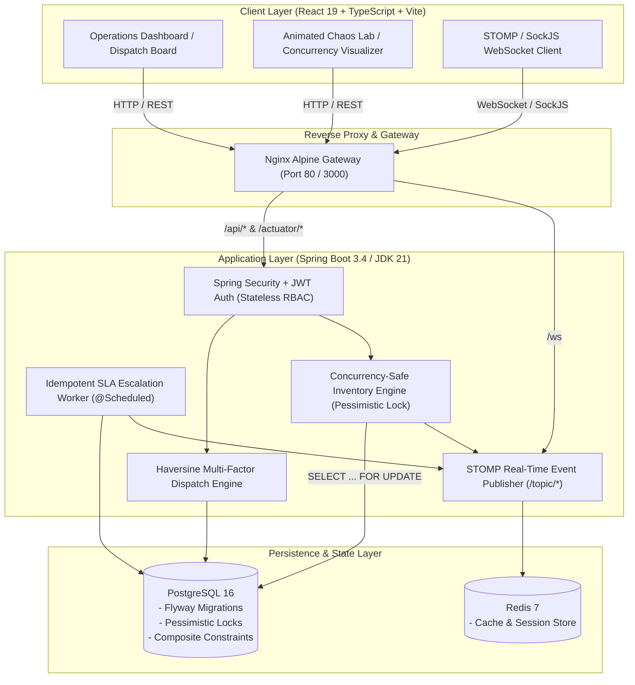

# SwiftRouteOS ⚡
### Intelligent SLA-Aware Field Service Dispatch & Operations Platform

[](https://openjdk.org/)
[](https://spring.io/projects/spring-boot)
[](https://react.dev/)
[](https://www.typescriptlang.org/)
[](https://www.postgresql.org/)
[](https://redis.io/)
[](https://www.docker.com/)
[](LICENSE)
[](backend/src/test)

---

## 📌 Executive Summary

**SwiftRouteOS** is an enterprise-grade Field Service Management (FSM) platform designed to orchestrate high-velocity dispatching, eliminate parts inventory race conditions, and guarantee Service Level Agreement (SLA) compliance for mission-critical equipment repair and utilities operations.

Unlike naive scheduling CRUD applications, SwiftRouteOS is engineered around **hard distributed systems challenges**:
* **Explainable Multi-Factor Scoring**: Transparent, deterministic algorithmic ranking combining spherical Haversine spatial math, technician skill matrices, real-time workload, and shift availability.
* **Pessimistic Row-Locking Concurrency**: Database-level `SELECT ... FOR UPDATE` isolation preventing parts overselling during concurrent dispatching across parallel operator sessions.
* **Idempotent SLA Escalation Engine**: Automated background evaluation worker backed by database unique constraints (`(job_id, threshold_stage)`), preventing duplicate alerts and alert fatigue.
* **Bidirectional STOMP WebSockets**: Instant operator notification of SLA breaches, status changes, and real-time inventory updates with automatic TanStack Query cache invalidation.
* **100% Lombok-Free Standard Java 21**: Built using clean Java records and POJOs for long-term JVM toolchain stability.

---

## 🏗 System Architecture



---

## ⚙️ Core Engineering Highlights

### 1. Explainable Dispatch Scoring Algorithm
When a service request requires dispatching, the engine ranks technicians using a deterministic multi-factor formula:
$$\text{Score} = (W_{skill} \cdot S_{skill}) + (W_{workload} \cdot S_{workload}) + (W_{shift} \cdot S_{shift}) - (W_{dist} \cdot \text{Distance}_{km})$$
* **Haversine Distance**: $O(1)$ spherical spatial distance between technician coordinates and job site coordinates. Requires zero external mapping API keys or network latency.
* **Full Explainability Breakdown**: Operators see granular score breakdowns (e.g., `+30 Exact Skill Match`, `+25 Low Workload`, `-8.4 Distance penalty`).
* **Mandatory Override Governance**: If an operator overrides the #1 recommended technician, the system demands an immutable override justification logged directly to `audit_events`.

### 2. Pessimistic Locking & Deadlock Prevention
High-volume dispatch operations create severe contention when multiple technicians or jobs compete for scarce replacement parts:
```sql
-- Executed inside @Transactional inventory reservation
SELECT * FROM inventory_items 
WHERE id = :itemId 
FOR UPDATE;
```
* **Zero Oversell Guarantee**: The transaction checks `(quantity_on_hand - quantity_allocated) >= requested_quantity` under exclusive row lock.
* **Deterministic Ordering**: Multi-part reservations sort item IDs in ascending order before locking, eliminating database deadlocks (`DeadlockLoserDataAccessException`).
* **Chaos Testing Verified**: Backed by high-concurrency 10-thread chaos tests (`InventoryDeadlockPreventionTest.java` and `InventoryConcurrencyTest.java`) ensuring 100% ACID compliance and HTTP 409 Conflict rollbacks.

### 3. Idempotent SLA Escalation Engine
Service requests are bound by priority-specific SLA targets:
| Priority | Response SLA | Resolution SLA | Escalation Interval |
|---|---|---|---|
| **CRITICAL** | 1 Hour | 4 Hours | Every 30 Seconds |
| **HIGH** | 2 Hours | 8 Hours | Every 30 Seconds |
| **MEDIUM** | 4 Hours | 24 Hours | Every 30 Seconds |
| **LOW** | 8 Hours | 48 Hours | Every 30 Seconds |

* **3-Stage Thresholds**: `HEALTHY` ($<70\%$), `NEARING_BREACH` ($70\% - 99\%$), `BREACHED` ($\ge 100\%$).
* **Database Unique Invariant**: `UNIQUE (job_id, threshold_stage)` guarantees that repeated background evaluation cycles never generate duplicate breach records or spam operator channels.

### 4. Real-Time STOMP WebSockets & Toast Alerts
* Connected clients subscribe to `/topic/jobs`, `/topic/sla-alerts`, `/topic/inventory`, and `/topic/chaos`.
* Upon message arrival, TanStack Query invalidates affected queries (`jobs`, `sla-metrics-summary`, `technicians`), updating the UI immediately without manual page refreshes.
* Critical SLA breaches trigger pulsing floating toasts with severity audio/visual cues.

---

## 🚀 Quick Start Guide

### Prerequisites
* [Docker Desktop](https://www.docker.com/) (Version 24+) **OR**
* [Java 21 OpenJDK](https://adoptium.net/) + [Node.js 20+](https://nodejs.org/) + [PostgreSQL 16](https://www.postgresql.org/)

---

### Option A: One-Click Docker Compose (Recommended)
Clone the repository and spin up all 4 microservices with a single command:
```bash
git clone https://github.com/Adityasharma2107/SwiftRouteOS.git
cd SwiftRouteOS

# Copy environment template
cp .env.example .env

# Build and start all services (PostgreSQL, Redis, Spring Boot, Nginx/React)
docker compose up --build -d
```
All services boot with integrated healthcheck gating:
* **Operations UI**: [http://localhost:80](http://localhost:80) or [http://localhost:3000](http://localhost:3000)
* **Spring Boot API & Actuator**: [http://localhost:8080/actuator/health](http://localhost:8080/actuator/health)
* **Interactive Swagger UI**: [http://localhost:8080/swagger-ui.html](http://localhost:8080/swagger-ui.html)
* **PostgreSQL Database**: `localhost:5432` (`swiftroute_db`)

---

### Option B: Bare-Metal Local Development

#### 1. Start Database & Cache
```bash
docker compose up -d postgres redis
```

#### 2. Start Spring Boot 3.4 Backend
```bash
cd backend
# Database migrations run automatically via Flyway
./mvnw clean spring-boot:run
```
Run the automated test suite:
```bash
./mvnw test
# Results: Tests run: 71, Failures: 0, Errors: 0, Skipped: 0
```

#### 3. Start React 19 Frontend
```bash
cd frontend
npm install
npm run dev
```
Frontend development server boots at [http://localhost:5173](http://localhost:5173) with hot-module reloading and proxying to backend on port 8080.

---

## 👥 Demo Personas & Pre-Seeded Credentials

SwiftRouteOS includes a **1-Click Persona Switcher** directly in the UI Header. You can also sign in manually with these credentials:

| Persona Name | Role | Username | Password | Operational Specialty |
|---|---|---|---|---|
| **Sarah Chen** | `DISPATCHER` | `dispatcher` | `password123` | Multi-territory triage, candidate scoring override |
| **Dave Miller** | `TECHNICIAN` | `tech_dave` | `password123` | Lead Commercial HVAC Specialist |
| **Elena Rostova**| `TECHNICIAN` | `tech_elena` | `password123` | Master High-Voltage Electrical Technician |
| **Marcus Vance** | `TECHNICIAN` | `tech_marcus` | `password123` | Master Industrial Plumbing & Boiler Systems |
| **Alex Rivera**  | `ADMIN` | `admin` | `password123` | Full system audit, SLA policy editor, parts reorder |

---

## 🌐 API & WebSocket Reference

### Core REST Endpoints
| Method | Path | Role | Description |
|---|---|---|---|
| `POST` | `/api/auth/login` | Public | Authenticate user; returns JWT Access & Refresh tokens |
| `POST` | `/api/auth/refresh` | Public | Issue new Access Token via valid Refresh Token |
| `GET` | `/api/jobs` | Authenticated | List all service jobs with priority, status, and SLA info |
| `POST` | `/api/jobs` | `DISPATCHER`, `ADMIN` | Create service job with automatic SLA deadline calculation |
| `GET` | `/api/dispatch/recommendations/{jobId}` | `DISPATCHER`, `ADMIN` | Compute ranked technician recommendations with score breakdown |
| `POST` | `/api/dispatch/confirm` | `DISPATCHER`, `ADMIN` | Confirm assignment with pessimistic locking & override justification |
| `PATCH`| `/api/jobs/{id}/transition` | Authenticated | Progress job status (`ASSIGNED` $\rightarrow$ `EN_ROUTE` $\rightarrow$ `IN_PROGRESS` $\rightarrow$ `COMPLETED`) |
| `GET` | `/api/inventory` | Authenticated | Retrieve parts inventory catalog and available stock |
| `POST` | `/api/inventory/reserve` | `DISPATCHER`, `TECHNICIAN`| Concurrency-safe parts reservation (`SELECT ... FOR UPDATE`) |
| `GET` | `/api/sla/metrics` | Authenticated | Real-time SLA compliance summaries and at-risk metrics |
| `POST` | `/api/sla/evaluate-now` | `ADMIN` | Force immediate on-demand SLA policy sweep |

### WebSocket STOMP Channels (`/ws`)
* `/topic/jobs`: Broadcasts `JOB_ASSIGNED`, `JOB_STATUS_CHANGED`, `JOB_CANCELLED`.
* `/topic/sla-alerts`: Broadcasts `SLA_WARNING` and `SLA_BREACHED` events.
* `/topic/inventory`: Broadcasts inventory stock changes and reservations.
* `/topic/chaos`: Broadcasts live multi-threaded concurrency simulation metrics.

---

## 🧪 Concurrency Chaos Lab

Navigate to the **Chaos Lab** view in the web UI to test and observe database pessimistic row locks under live multithreaded contention:
1. Select a scarce inventory item (e.g., `SCARCE-SENSOR-CHILLER`, Quantity on Hand: 1).
2. Configure **10 to 20 concurrent worker threads**.
3. Trigger the simulation.
4. **Observe Real-Time Invariant**: Exactly 1 thread acquires the row lock (`HTTP 200 OK`), while 9+ threads safely roll back (`HTTP 409 Conflict`), visually proving zero inventory oversell.

---

## 📂 Repository Structure

```
SwiftRouteOS/
├── .github/
│   └── workflows/
│       └── ci.yml                 # Automated CI: Maven Test, NPM Lint/Build, Docker Smoke
├── backend/
│   ├── Dockerfile                 # Multi-stage Eclipse Temurin JDK 21 / JRE 21 alpine image
│   ├── pom.xml                    # Spring Boot 3.4.3 dependencies (Pure POJOs, no Lombok)
│   └── src/
│       ├── main/
│       │   ├── java/com/swiftroute/
│       │   │   ├── config/        # Security, WebSocket, OpenAPI, Auditing configuration
│       │   │   ├── controller/    # REST API endpoints with standard ApiResponse envelopes
│       │   │   ├── dto/           # Strongly-typed Java POJO request/response models
│       │   │   ├── entity/        # JPA Entities (Job, Technician, Inventory, SLA, Audit)
│       │   │   ├── repository/    # Spring Data JPA repositories with pessimistic lock queries
│       │   │   ├── scheduler/     # @Scheduled SLA escalation background worker
│       │   │   ├── security/      # JWT token provider, filters, and authentication entry point
│       │   │   └── service/       # Domain business logic (Dispatch, SLA, Inventory, Job)
│       │   └── resources/
│       │       ├── application.yml
│       │       └── db/migration/  # Flyway V1 schema and V2 seed reference migrations
│       └── test/                  # 71 Integration, Unit, and Concurrency Chaos tests
├── frontend/
│   ├── Dockerfile                 # Multi-stage Node 22 build + Nginx Alpine runtime
│   ├── nginx.conf                 # Edge reverse proxy, SPA fallback, WebSocket upgrade
│   ├── package.json               # React 19, TypeScript, Tailwind CSS v4, TanStack Query
│   └── src/
│       ├── api/                   # Axios client with JWT auto-refresh and typed API calls
│       ├── components/            # Dispatch recommendation, override modal, job drawer
│       ├── context/               # AuthContext (persona switcher), WebSocketContext (STOMP)
│       ├── views/                 # DispatchBoard, JobManagement, ChaosLab, Inventory, SlaView
│       └── types/                 # Shared TypeScript domain contracts
├── docker-compose.yml             # Orchestration: postgres, redis, backend, frontend
└── .env.example                   # 12-factor environment variable template
```

---

## 📄 License
This project is licensed under the MIT License — see the [LICENSE](LICENSE) file for details.
