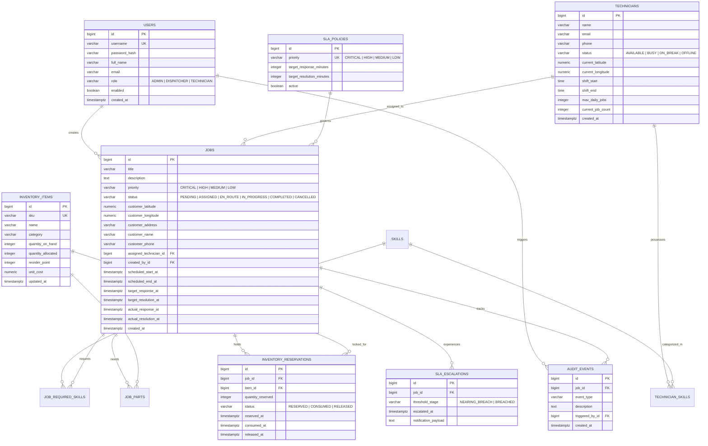
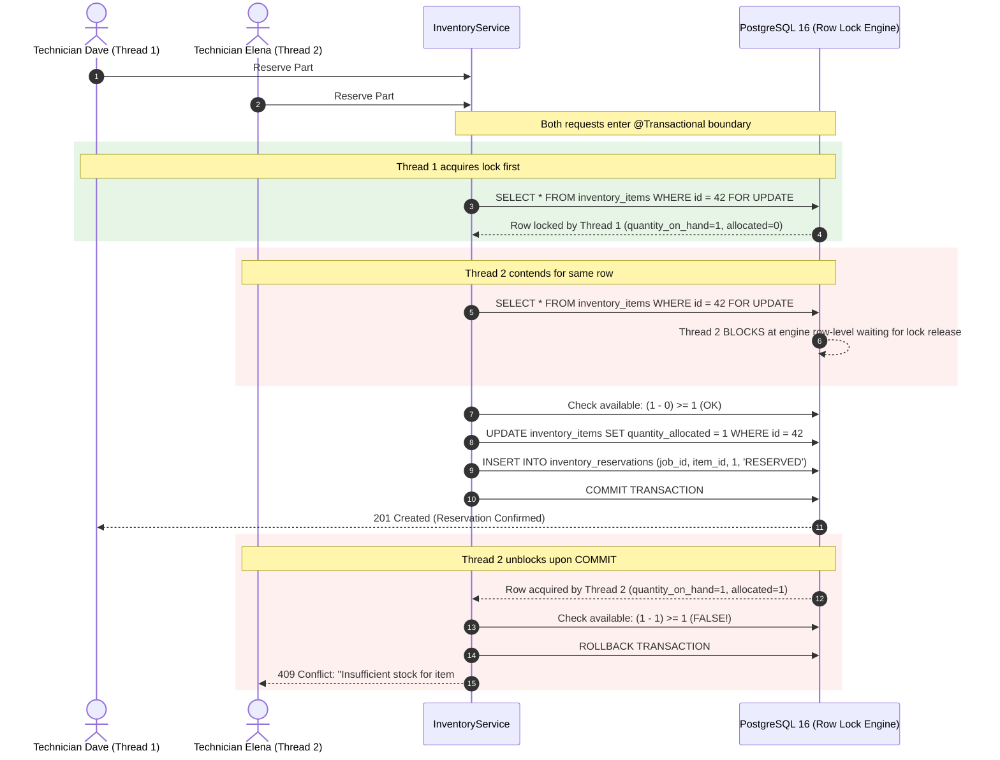
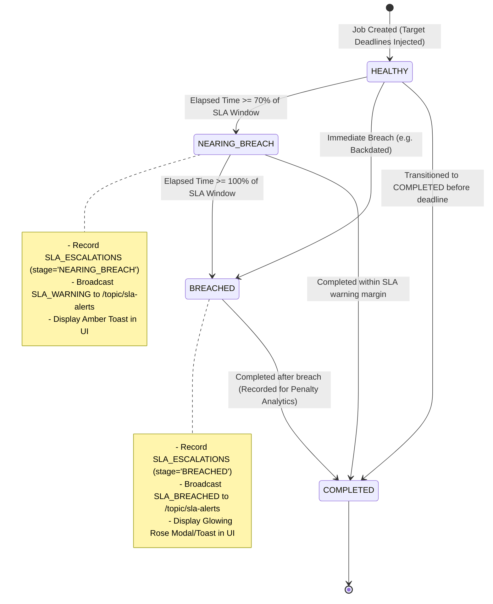

# SwiftRouteOS: Deep Dive Architecture & System Specifications

## 1. Domain Data Model & Entity-Relationship Architecture

SwiftRouteOS persists its operational state across a normalized PostgreSQL 16 schema managed through sequential Flyway migrations (`V1__init_schema.sql` and `V2__seed_reference_data.sql`).



---

## 2. Pessimistic Locking & Deadlock Elimination Mechanics

### The Distributed Concurrency Problem
Field service organizations encounter critical race conditions when multiple dispatchers or technicians simultaneously claim scarce replacement parts (e.g., an industrial chiller compressor sensor with `quantity_on_hand = 1`). Optimistic concurrency (`@Version`) would abort transactions after lengthy business logic execution, wasting I/O and creating frustrating user retries.

### Database Row Lock Acquisition Sequence
SwiftRouteOS implements strict database-level row locking with defensive deadlock ordering:



### Multi-Item Deadlock Prevention
When reserving multiple parts in a single transaction, locking items in arbitrary order creates circular wait dependencies:
$$\text{Thread 1: Locks Item A} \rightarrow \text{Waits for Item B}$$
$$\text{Thread 2: Locks Item B} \rightarrow \text{Waits for Item A} \implies \text{DEADLOCK!}$$

**Elimination Strategy**: SwiftRouteOS enforces **Natural Ascending ID Ordering** before executing `FOR UPDATE`:
```java
// InventoryService.java
List<Long> orderedItemIds = request.getItemReservations().stream()
    .map(ItemReservationRequest::getItemId)
    .sorted() // Deterministic ascending order
    .toList();

for (Long itemId : orderedItemIds) {
    InventoryItem item = inventoryItemRepository.findByIdForUpdate(itemId)
        .orElseThrow(...);
    // Safe sequential lock acquisition
}
```

---

## 3. SLA Escalation Engine State Machine

The SLA Escalation Engine evaluates open service requests against pre-configured response and resolution thresholds.



### Idempotency Guarantee
The background worker executes every 30 seconds (`@Scheduled(fixedRateString = "${swiftroute.sla.scheduler-rate-ms:30000}")`). To prevent alert spamming:
1. The table `sla_escalations` enforces:
   ```sql
   CONSTRAINT uq_sla_job_threshold UNIQUE (job_id, threshold_stage)
   ```
2. When the worker detects a job at $\ge 70\%$ or $\ge 100\%$, it checks `slaEscalationRepository.existsByJobIdAndThresholdStage(jobId, stage)`.
3. If concurrent worker threads overlap, the database constraint rejects the duplicate insert, ensuring zero duplicate alerts.

---

## 4. Haversine Spatial Geometry & Multi-Factor Scoring

### Spherical Distance Formula
Given technician coordinates $(\phi_1, \lambda_1)$ and customer site coordinates $(\phi_2, \lambda_2)$ in radians:
$$\Delta\phi = \phi_2 - \phi_1, \quad \Delta\lambda = \lambda_2 - \lambda_1$$
$$a = \sin^2\left(\frac{\Delta\phi}{2}\right) + \cos(\phi_1)\cos(\phi_2)\sin^2\left(\frac{\Delta\lambda}{2}\right)$$
$$c = 2 \cdot \text{atan2}\left(\sqrt{a}, \sqrt{1 - a}\right)$$
$$\text{Distance} = R \cdot c \quad (R = 6,371.0 \text{ km})$$

Implemented in pure Java without third-party dependencies, guaranteeing $O(1)$ computation time and 100% deterministic unit testing.

### Candidate Ranking Formula
$$TotalScore = S_{skill} + S_{workload} + S_{shift} - P_{dist}$$

| Factor | Weight Range | Calculation Logic |
|---|---|---|
| **Skill Match** | $0 \dots 40$ pts | Ratio of matched required skills: $(N_{matched} / N_{required}) \cdot 40$ |
| **Workload** | $0 \dots 25$ pts | Inverse daily load: $\max(0, 25 - (current\_jobs \cdot 5))$ |
| **Shift Window** | $0 \dots 20$ pts | Full points if shift end is $> 2$ hours away; decrements linearly |
| **Distance Penalty** | $-0.5 \text{ pts} / \text{km}$ | Decrement proportional to spatial separation: $\min(30, \text{Distance}_{km} \cdot 0.5)$ |

---

## 5. Security & Authentication Architecture

SwiftRouteOS employs stateless, cryptographically secure JWT authentication:
* **Access Token**: Short-lived (default 24 hours), carrying user ID, username, and assigned authority (`ROLE_DISPATCHER`, `ROLE_TECHNICIAN`, `ROLE_ADMIN`).
* **Refresh Token**: Long-lived (default 7 days), securely stored in browser local storage and used for silent background refreshing on HTTP 401.
* **Axios Interceptor**: Queues failed requests while refreshing the token, replaying pending calls transparently without dropping user actions.
* **RBAC Enforcement**: Declarative method security (`@PreAuthorize("hasRole('ADMIN')")`) backed by a strict Spring Security filter chain.
